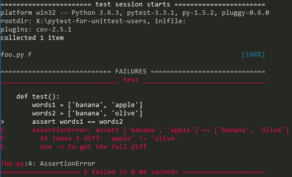
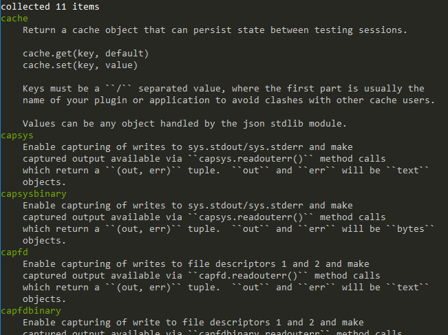

@title[Quick pytest for unittest users]

# Quick <span class="gold">pytest</span> intro

### A quick introduction to pytest for unittest users

Very basic! 
<br>
Really, for people who don't know pytest at all

---

@title[What]

* Dive Into Python 3: www.diveintopython3.net
* Let's learn some pytest using **Chapter 6**


---

Fork and clone the repository

https://github.com/nicoddemus/pytest-for-unittest-users

---

Create a virtual env

**Linux**

```
$ python3 -m venv .env
$ source activate .env
```

**Windows**

```
$ py -3.6 -m venv .env
$ .env\Scripts\activate.bat
```

---

Run it

```
$ python -m unittest
...........
----------------------------------------------------------------------
Ran 11 tests in 0.027s

OK
```

All set!

---

## Quick overview of the code

---

**!!Wait!!**

**Disclaimer**

`unittest` is a nice framework

---

@title[roman7.py]

`roman7.py`

```python
def to_roman(n):
    '''convert integer to Roman numeral'''
    ...
    
def from_roman(s):
    '''convert Roman numeral to integer'''
    ...    
```

---

@title[KnownValues]

`KnownValues`

```python
class KnownValues(unittest.TestCase):
    known_values = ( (1, 'I'),
                     (2, 'II'),
                      ...
                     (3999, 'MMMCMXCIX'))

    def test_to_roman_known_values(self):
        '''to_roman should give known result with known input'''
        for integer, numeral in self.known_values:
            result = roman7.to_roman(integer)
            self.assertEqual(numeral, result)
```

---

@title[ToRomanBadInput]


`ToRomanBadInput`

```python
class ToRomanBadInput(unittest.TestCase):
    def test_too_large(self):
        '''to_roman should fail with large input'''
        self.assertRaises(roman7.OutOfRangeError, roman7.to_roman, 4000)
```

---

@title[FromRomanBadInput]

`FromRomanBadInput`

```python
class FromRomanBadInput(unittest.TestCase):
    def test_too_many_repeated_numerals(self):
        '''from_roman should fail with too many repeated numerals'''
        for s in ('MMMM', 'DD', 'CCCC', 'LL', 'XXXX', 'VV', 'IIII'):
            self.assertRaises(roman7.InvalidRomanNumeralError, roman7.from_roman, s)
```


---

@title[RoundtripCheck]

`RoundtripCheck`

```python
class RoundtripCheck(unittest.TestCase):
    def test_roundtrip(self):
        '''from_roman(to_roman(n))==n for all n'''
        for integer in range(1, 4000):
            numeral = roman7.to_roman(integer)
            result = roman7.from_roman(numeral)
            self.assertEqual(integer, result)
```


---

### How can I use pytest?

pytest is easy to get started with


---

Installation

```
$ pip install pytest
```

---


Can run unittest-based tests out of the box

*Look ma, no changes!*

```
$ pytest
```

 


---

- Easy to get started
- No need to convert your entire suite |
- No need to learn a whole framework from the get-go |
- Learn it at your own pace |


---

Let's simplify `RoundtripCheck` 

```python
import unittest
import roman7

class RoundtripCheck(unittest.TestCase):
    def test_roundtrip(self):
        '''from_roman(to_roman(n))==n for all n'''
        for integer in range(1, 4000):
            numeral = roman7.to_roman(integer)
            result = roman7.from_roman(numeral)
            self.assertEqual(integer, result)
```

---

unittest requires to use and remember bunch of `self.assert*` methods

```python
    self.assertEqual(x, 15)
    self.assertIsNone(result)
    self.assertIn(k, d)
    self.assertSequencesEqual(words1, words2)
    self.assertLess(x, 5)
```

---

pytest lets you write simple `assert` statements

```python
    assert x == 15
    assert result is None
    assert k in d
    assert words1 == words2
    assert x < 5
```

---

... and still get nice error messages 

 

---

change `self.assertEqual` to an `assert` 

```python
import unittest
import roman7

class RoundtripCheck(unittest.TestCase):
    def test_roundtrip(self):
        '''from_roman(to_roman(n))==n for all n'''
        for integer in range(1, 4000):
            numeral = roman7.to_roman(integer)
            result = roman7.from_roman(numeral)
            assert integer == result
```


---

# Subclassing

---

`unittest` requires you to declare `TestCase` subclasses

```python
import unittest

class RoundtripCheck(unittest.TestCase):

    def test_roundtrip(self):
        ...
```

(no biggie, but *nhé*)


---

`pytest` lets you use simple *functions*

```python
import roman7

def test_roundtrip():
    ...
```

--- 

Get rid of the class 

```python
import roman7

def test_roundtrip():
    '''from_roman(to_roman(n))==n for all n'''
    for integer in range(1, 4000):
        numeral = roman7.to_roman(integer)
        result = roman7.from_roman(numeral)
        assert integer == result
```  

---

It still passes of course 

 

--- 

pytest still lets you use classes if you want

```python

class TestAPI:

    def test_login(self):
        ...
    def test_home(self):
        ...
```

But works mostly for grouping and is not a requirement!


---

Fine to mix pytest-style and unittest-style tests

even in the same file


---

Final message: easy to get started, no boilerplate 😁


---

Now on to some more pytest features

(No longer hands-on)


--- 

### setUp/tearDown & friends

Proper resource acquisition and cleanup is vital 

tests must be isolated and reproducible


---

### unittest

- `setUp`/`tearDown`
- `setUpClass`/`tearDownClass` 
- `setUpModule`/`tearDownModule` 

---

```python
from app.db import get_db

class TestAccess(unittest.TestCase):

    @classmethod
    def setUpClass(cls):
        cls.db_directory = tempfile.mkdtemp()
        cls.db_file = cls.db_directory + '/app.db'        
        get_db().init(cls.db_file)
        
    @classmethod
    def tearDownClass(cls):
        get_db().disconnect(cls.db_file)
        shutil.rmtree(cls.db_directory) 
    ...       
```

(Bear with me, completely made up db access code)

---

```python
class TestAccess(unittest.TestCase):

    def setUp(self):
        self.session = get_db().create_session()
        
    def tearDown(self):
        self.session.rollback()
        get_db().close_session(self.session)
        
    def test_create_user(self):
        self.session.create_new_user('Jack')
        self.assertEqual(len(self.session.get_users()), 1)           
```

---

OK, but has a few drawbacks:

- `setUp` must create everything for all tests
- Different setups need separate classes

---

How to share setup/teardown code between modules? 

*subclassing*

---

This gets messy *fast*, specially in large code bases.

<ul>
<li class="fragment">`BaseTestCase`: general utilities</li>
<li class="fragment">`GUITestCase(BaseTestCase)`: Qt widgets</li>
<li class="fragment">`VTKTestCase(GUITestCase)`: VTK utilities</li>
<li class="fragment">`PlotTestCase(GUITestCase)`: plotting utilities</li>
</ul>

---

Now if I a test needs plotting and VTK...

---

`DearLordTestCase(VTKTestCase, PlotTestCase)` 


Does not scale!

---

### pytest fixtures

functions that create/destroy resources

---

Back to our `unittest` example

```python
class TestAccess(unittest.TestCase):

    ...
    
    def setUp(self):
        self.session = get_db().create_session()
        
    def tearDown(self):
        self.session.rollback()
        get_db().close_session(self.session)
        
    def test_create_user(self):
        self.session.create_new_user('Jack')       
        self.assertEqual(len(self.session.get_users()), 1)    
```

---

Using a `pytest` fixture

```python
class TestAccess:

    ...
    
    @pytest.fixture
    def session(self):
        session_ = get_db().create_session()
        yield session_
        get_db().close_session(session_)        
        
    def test_create_user(self, session):
        session.create_new_user('Jack')      
        assert len(self.session.get_users()) == 1     
```

*Dependency Injection, baby!*

Note:
- no unittest subclass
- context manager
- have as much as like 

--- 

Of course, classes are optional

```python
@pytest.fixture
def session():
    session_ = get_db().create_session()
    yield session_
    get_db().close_session(session_)        
    
def test_create_user(session):
    session.create_new_user('Jack')           
    assert len(session.get_users()) == 1
```


---

What about `setUpModule` and `setUpClass`?


---

Fixtures have **scopes**!

- `@pytest.fixture(scope='function')` (default)
- `@pytest.fixture(scope='class')`
- `@pytest.fixture(scope='module')`
- `@pytest.fixture(scope='session')`


---

Back to our example

```python
from app.db import get_db

class TestAccess(unittest.TestCase):

    @classmethod
    def setUpClass(cls):
        cls.db_directory = tempfile.mkdtemp()
        cls.db_file = cls.db_directory + '/app.db'        
        get_db().init(cls.db_file)
        
    @classmethod
    def tearDownClass(cls):
        get_db().disconnect(cls.db_file)
        shutil.rmtree(cls.db_directory) 
        
    def test_create_user(self):
        self.session.create_new_user('Jack')
        self.assertEqual(len(self.session.get_users()), 1)
```

---

Using a class-scoped fixture

```python
class TestAccess:

    @pytest.fixture(scope='class')
    def init_db(cls):
        db_directory = tempfile.mkdtemp()
        db_file = db_directory + '/app.db'        
        get_db().init(db_file)
        yield db_file
        get_db().disconnect(db_file)
        shutil.rmtree(db_directory) 
              
    def test_create_user(self, session, init_db):  # <---
        session.create_new_user('Jack')           
        assert len(session.get_users()) == 1
```

Note:
Needs init_db

---

Fixtures can be marked as `autouse`!

```python
class TestAccess:

    @pytest.fixture(scope='class', autouse=True)
    def init_db(cls):
        db_file = tempfile.mkdtemp() + '/app.db'        
        get_db().init(db_file)
        yield db_file
        get_db().disconnect(db_file)
        os.remove(db_file) 
                            
    def test_create_user(self, session):
        session.create_new_user('Jack')           
        assert len(session.get_users()) == 1
```


---

But even better, fixtures can depend on other fixtures

```python
class TestAccess:

    @pytest.fixture(scope='class')
    def init_db(cls):
        ...
        
    @pytest.fixture
    def session(self, init_db):  # <--
        session_ = get_db().create_session()
        yield session_
        get_db().close_session(session_)
        
    def test_create_user(self, session):
        session.create_new_user('Jack')           
        assert len(session.get_users()) == 1  
```

---

**Important point**

Changes in fixture requirements don't reflect on tests!

```python
class TestAccess:
    ...
    def test_create_user(self, session):
        session.create_new_user('Jack')           
        assert len(session.get_users()) == 1
```

---

Sharing setup/teardown across files with `unittest`

A few options 🤔

---

**Copy and Paste**


---

**Subclasses ahoy** 


*!!cheap shot bonus!!*


---

**Mixins**

Better option I know with `unittest`-based testing

---

Sharing fixtures across files?

---

Meet the `conftest.py` file!

```
app/
tests/
  conftest.py
  test_access.py
  test_prune.py
  acceptance/
    test_usability.py
```

---

`conftest.py` files are a convenient way to share fixtures

---

more importantly: *without changing test code*


---

Fixtures are the only way to setup/teardown?

--- 

pytest has unittest-like methods if you want them

```python
class Test:
    def setup_method(self, method):
        ...
    def teardown_method(self, method):
        ...
        
    @classmethod
    def setup_class(cls):
        ...
    @classmethod
    def teardown_class(cls):
        ...
```

But fixtures are *strongly* recommended


---

## built-in features

---

**Output capturing**

```
def test():
    print('debug debug debug')
    assert some_condition() == True
```

---

Output captured and hidden by default

```
======================= test session starts =======================
platform win32 -- Python 3.6.3, pytest-3.2.5, py-1.5.2, pluggy-0.4.0
rootdir: X:\pytest-for-unittest-users, inifile:
collected 1 item

foo.py .

==================== 1 passed in 0.01 seconds =====================
```

---

If it fails it is displayed in its own section

```
============================ FAILURES =============================
______________________________ test _______________________________

    def test():
        print('debug debug debug')
>       assert some_condition() == True
E       assert False == True
E        +  where False = some_condition()

foo.py:6: AssertionError
---------------------- Captured stdout call -----------------------
debug debug debug
==================== 1 failed in 0.05 seconds =====================
```

---

**Warnings capturing**

Captured and shown at the end of the run by default

```
======================== warnings summary ========================
test_show_warnings.py::test_one
  test_show_warnings.py:4: UserWarning: api v1, should use functions from v2
    warnings.warn(UserWarning("api v1, should use functions from v2"))

-- Docs: http://doc.pytest.org/en/latest/warnings.html
============== 1 passed, 1 warnings in 0.12 seconds ==============
```

Can be configured with same options as Python's `-W`

--- 

**doctests**

```python
def answer_to_life_universe_and_everything():
    """Please compute the answer to Life, Universe and everything.
    
    >>> answer_to_life_universe_and_everything()
    42
    """
    return 42
```

```
$ pytest --doctest-modules
```

--- 

**JUnitXML reports**

```
$ pytest --junitxml=tests.xml
```

For use with your CI of choice


---

Run control options

<ul>
<li class="fragment">`pytest -ff`: run failed tests first</li>
<li class="fragment">`pytest -lf`: last failed tests</li>
<li class="fragment">`pytest -x`: stop on first failure</li>
<li class="fragment">`pytest -lf -x`: refactoring heaven 😍</li>
</ul>


---

`pytest.raises`

```python
def test_check_bounds():
    my_array = CustomArray()
    with pytest.raises(IndexError):        
        my_array[0]
```

Similar to `self.assertRaises`

---

`pytest.warns`

```python
def test_warning():
    with pytest.warns(UserWarning):
        warnings.warn("my warning", UserWarning)
```

Similar to `self.assertWarns`

---

`pytest.approx`

```python
from pytest import approx

def test():
    assert compute() == approx(1.63)
```

Similar to `self.assertAlmostEqual`


---

Skipping tests

```python
def test_windows_console_bug():
    if sys.platform != 'win':
        pytest.skip('test only relevant on Windows')
```

```python
@pyest.mark.skipif(sys.platform != 'win', 
                   reason='test only relevant on Windows')
def test_windows_console_bug():
    ...
```

```python
def test_numpy():
    numpy = pytest.importorskip('numpy')
    a = numpy.arange(10)
```

---

Expected failures (xfail)

```python
def test_array_crash():
    if numpy.__version__ == '1.11.0':
        pytest.xfail('this tests crashes on numpy 1.11.0')
```

```python
@pytest.mark.xfail(numpy.__version__ == '1.11.0', 
                   'this tests crashes on numpy 1.11.0')
def test_array_crash():
    ...
```

---


## built-in fixtures

```
$ pytest --fixtures
```



---

`tmpdir`

```python
def test_save(tmpdir):
    f = tmpdir / 'hello.txt'
    save_greetings(str(f))
    assert f.read() == 'Hello world!'
```

API similar to `pathlib.Path`

---

`capsys` and `capfd`

```python
def test_output(capsys):
    print("Hello world!")    
    cap = capsys.readouterr()
    assert cap.out == "Hello World!\n"
```

---

## plugins

pytest has a vast ecosystem of plugins

---

Installation

```
$ pip install pytest-X
```

*No activation or registration necessary*


---

## pytest-xdist

Run tests in parallel

```
$ pytest -n auto
```


---

## pytest-cov

Integration with `codecov`

```
pytest test_roman.py --cov roman7
======================= test session starts =======================
...
plugins: cov-2.5.1
collected 11 items

test_roman.py ...........

-------- coverage: platform win32, python 3.6.3-final-0 -----------
Name        Stmts   Miss  Cover
-------------------------------
roman7.py      29      0   100%

==================== 11 passed in 0.14 seconds ====================
```
---

## pytest-mock

`unittest.mock` helper for pytest

```
class UnixFS:
    @staticmethod
    def rm(filename):
        os.remove(filename)

def test_unix_fs(mocker):
    mocker.patch('os.remove')
    UnixFS.rm('file')
    os.remove.assert_called_once_with('file')
```

---

## pytest-django

Fixtures to test your Django app

```
def test_with_client(client):
    response = client.get('/')
    assert response.content == 'Foobar'
```

---

## pytest-flask

Fixtures to test your Flask app

```python
@api.route('/ping')
def ping():
    return jsonify(ping='pong')

def test_api_ping(client):
    res = client.get(url_for('api.ping'))
    assert res.json == {'ping': 'pong'}
```

---

## pytest-flakes

Static analysis checker

```
$ py.test -q --flakes
F
========================= FAILURES ==========================
_______________________ pyflakes-check ______________________
/tmp/doc-exec-685/module.py:2: UnusedImport
'os' imported but unused
/tmp/doc-exec-685/module.py:3: ImportStarUsed
'from os.path import *' used; unable to detect undefined names
```


---

## pytest-asyncio

Testing `asyncio` applications

```python
@pytest.mark.asyncio
async def test_some_asyncio_code():
    res = await library.do_something()
    assert b'expected result' == res
```

---

## pytest-tornado

Testing `tornado` applications

```python
@pytest.mark.gen_test
def test_hello_world(http_client, base_url):
    response = yield http_client.fetch(base_url)
    assert response.code == 200
```

---

## pytest-bdd

Behavioral driven development

```feature
Feature: Blog
    A site where you can publish your articles.

Scenario: Publishing the article
    Given I'm an author user
    And the article should be published  # Note: will query the database
```

```python
@scenario('publish_article.feature', 'Publishing the article')
def test_publish():
    pass

@given("I'm an author user")
def author_user(auth, author):
    auth['user'] = author.user

@then('the article should be published')
def article_is_published(article):
    article.refresh()  # Refresh the object in the SQLAlchemy session
    assert article.is_published
```

---

## pytest-selenium

Black box testing with browsers

```python
def test_homepage(selenium):
    selenium.get('https://www.mozilla.org')
    selenium.find_element_by_id('close_takeover').click()
    assert selenium.title == "We're building a better internet"
```

Supports Firefox, Edge, Chrome, IE, Safari, ...

*Used and maintained by Mozilla*

---

## pytest-html

Beautiful HTML reports


---

## pytest-cpp

Run C++ tests written in `GTest` or `Boost::Test` 


---

## pytest-randomly 


Runs tests in random order to catch hidden test dependencies

```
$ pytest
...
Using --randomly-seed=1460130750
```

To reproduce a failed run:

```
$ py.test --randomly-seed=1234
```

--- 

## pytest-qt

Test Qt applications (supports PyQt and PySide)

```python
def test_hello(qtbot):
    widget = HelloWidget()
    qtbot.addWidget(widget)
    qtbot.mouseClick(window.button_greet, QtCore.Qt.LeftButton)
    assert window.greet_label.text() == 'Hello!'
```

---

## pytest-console-scripts

Black box testing for command-line applications

```python
def test_foo_bar(script_runner):
    ret = script_runner.run('foo', 'bar')
    assert ret.success
    assert ret.stdout == 'bar\n'
    assert ret.stderr == ''
```

--- 

## pytest-datadir

Access supporting data files from tests

```
├── test_hello/
│   └── spam.txt
└── test_hello.py
```

```python
def test_read_module(datadir):
    contents = (datadir / 'spam.txt').read_text()
    assert contents == 'eggs\n'
```


---

😅

pytest has over **350** plugins

plugincompat.herokuapp.com

---

@title[Thanks]

**That's all!**
<br>
Thanks everyone!


---

@title[Me]


## Bruno Oliveira

<span align="left">
**GitHub:** https://github.com/nicoddemus
<br>
**Twitter:** `@nicoddemus`
</span> 

